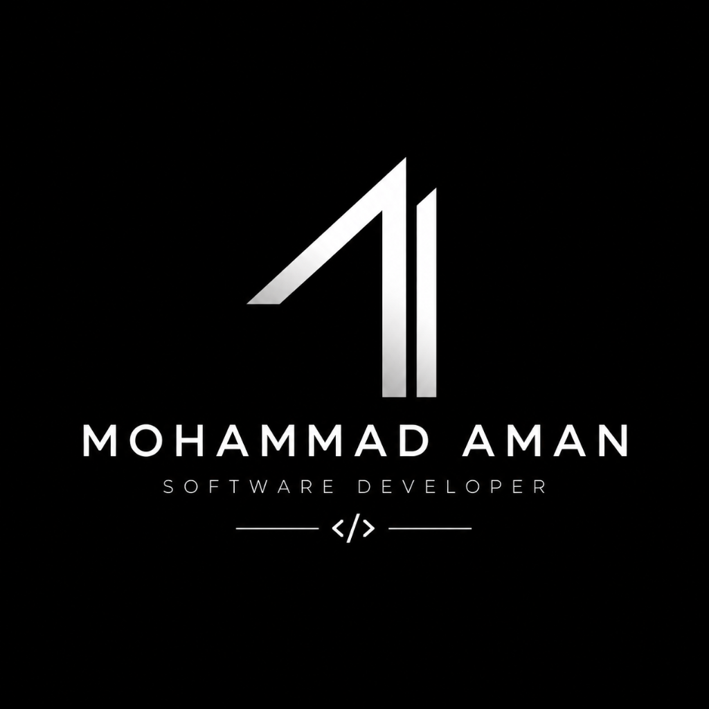
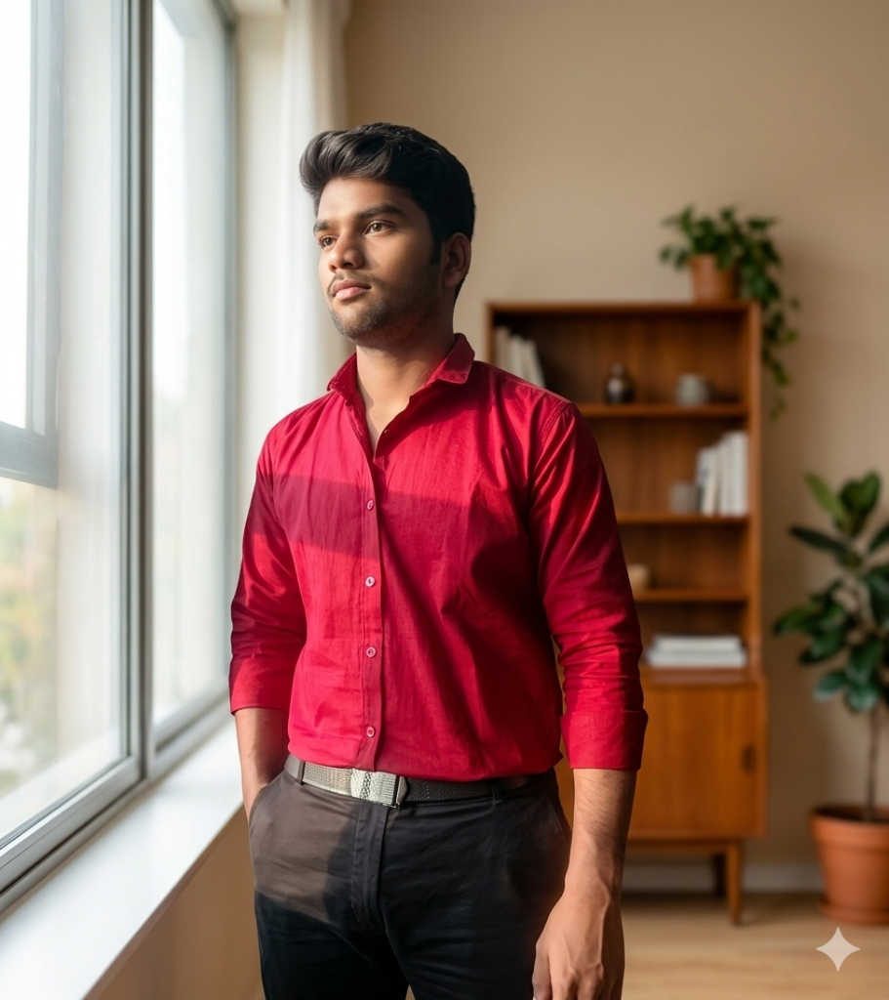

<div align="center">

  

  # Mohammad Aman — Portfolio

  ### Software Developer · Problem Solver · Builder

  <p>
    A clean, responsive portfolio for sharing my journey, technical skills,<br />
    selected projects, and ways to connect.
  </p>

  <p>
    <a href="https://porfolio-git-main-aman-portfolio9.vercel.app/">
      <strong>Visit the live portfolio →</strong>
    </a>
  </p>

  
  
  
  

</div>

<br />

## ✨ At a glance

This portfolio is designed to make a first impression quickly while still giving visitors a clear view of my work. It combines a minimal black-and-white visual system with subtle motion, responsive layouts, and focused content.

<table>
  <tr>
    <td width="50%" valign="top">
      <h3>What you’ll find</h3>
      <ul>
        <li>Personal introduction and developer profile</li>
        <li>Experience and development journey</li>
        <li>Technical skills and tools</li>
        <li>Selected project highlights</li>
        <li>Direct contact call-to-action</li>
      </ul>
    </td>
    <td width="50%" valign="top">
      <h3>Built with intention</h3>
      <ul>
        <li>Responsive across desktop and mobile</li>
        <li>Semantic HTML and accessible labels</li>
        <li>Scroll reveal and active navigation states</li>
        <li>Mobile navigation with keyboard-friendly controls</li>
        <li>No framework or build step required</li>
      </ul>
    </td>
  </tr>
</table>

## 🖼️ Visual preview

<div align="center">
  <table>
    <tr>
      <td align="center" width="50%">
        
        <br />
        <sub><strong>Developer profile</strong></sub>
      </td>
      <td align="center" width="50%">
        
        <br />
        <sub><strong>Portfolio identity</strong></sub>
      </td>
    </tr>
  </table>
</div>

> The live experience is available at [porfolio-git-main-aman-portfolio9.vercel.app](https://porfolio-git-main-aman-portfolio9.vercel.app/).

## 🚀 Featured projects

| Project | Description |
| --- | --- |
| **Calculator** | A sleek, functional calculator built with modern web technologies. |
| **PGRS** | A location-based application for route and position guidance. |
| **TryOn 3D** | A 3D virtual try-on experience using modern rendering technologies. |
| **Password Analyzer** | A password-strength tool with practical security recommendations. |

## 🧰 Skills & tools

<p>
  
  
  
  
  
  
  
  
  
</p>

## 💻 Run locally

Because this is a static site, you can open `index.html` directly. For the best development experience, serve the folder with any local web server:

```bash
git clone https://github.com/MD-aman-ansari/porfolio.git
cd porfolio
```

Then open `index.html` in your browser, or use VS Code Live Server on the configured development port.

## 📁 Project structure

```text
porfolio/
├── index.html     # Page content and portfolio sections
├── style.css      # Responsive layout, theme, and animations
├── main.js        # Navigation and scroll interactions
├── profile.jpg    # Profile image
├── logo.png       # Portfolio logo
└── README.md      # Project overview
```

## 📬 Let’s connect

Have an idea, opportunity, or project to discuss?

- **Email:** [ansariamaan8640@gmail.com](mailto:ansariamaan8640@gmail.com)
- **Portfolio:** [Open the live website](https://porfolio-git-main-aman-portfolio9.vercel.app/)

<br />

<div align="center">
  <sub>Designed and built by <strong>Mohammad Aman</strong> · Keep learning, keep building.</sub>
</div>
